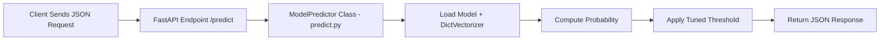

# 🏠 Room Classification with Deep Learning – Image Recognition API

This project implements an end-to-end deep learning system for classifying indoor room images into one of the following categories:

- Bedroom
- Living Room
- Bathroom
- Kitchen

The solution includes model training, evaluation, and a production-ready inference API for real-time image classification.

## Features

-   Full ML training pipeline (preprocessing → model selection →
    fine-tuning → serialization)
-   FastAPI inference service exposing a `/classify` endpoint
-   Dockerized deployment for reproducible and portable serving
-   Clean REST interface returning both probability and binary
    classification

The model predicts the probability that a borrower will default, based
on demographic, financial, and credit history features.

------------------------------------------------------------------------

## 🧩 Problem Statement

### Problem:
Real-time applications for indoor image recognition—such as real estate listing tagging, smart home automation, and interior design tools—require immediate room classification. High-latency models, even if slightly more accurate, are impractical in these scenarios.

### Challenges of incorrect or delayed predictions:

Slow responses → Poor user experience in live applications

Inefficient workflows → Delays in automated tagging and search indexing

Increased infrastructure costs → Heavy models require more compute and memory

### Objective:

Predict room type (Bedroom, Living Room, Bathroom, Kitchen) in real time

Use a lightweight, fast model optimized for inference speed

Provide results through a production-ready REST API

### Solution:
This project demonstrates a production-ready approach to room classification that balances speed and accuracy, making it ideal for applications where fast, scalable predictions are critical.

------------------------------------------------------------------------

## 📊 Initial Dataset and Train Dataset Construction Description

This project uses the SUN RGB-D dataset as the raw data source. Since the original dataset contains many indoor scene categories and varying image quality, a custom preprocessing pipeline was implemented to extract, clean, and structure a high-quality dataset suitable for deep learning.

------------------------------------------------------------------------

🗂️ Source Dataset

Dataset: SUN RGB-D (https://rgbd.cs.princeton.edu/)
Dataset download link: https://rgbd.cs.princeton.edu/data/SUNRGBD.zip (6.4GB)
Type: Indoor RGB images
Annotations used: scene.txt labels
Selected classes:
- Bedroom
- Bathroom
- Kitchen
- Living Room
Only scenes belonging to these four categories were retained.

🔄 Dataset Extraction Pipeline
1. Scene Filtering

Each scene directory in SUN RGB-D contains a scene.txt file.
The script:

Reads the scene label

Keeps only the following classes: bedroom, bathroom, kitchen, living_room

Ignores all other room types

2. Image Extraction

For each valid scene:

The first RGB image from the image/ directory is selected

Images are copied into class-specific folders:

```
dataset/
├── bedroom/
├── bathroom/
├── kitchen/
└── living_room/
```
Each image is renamed using its scene ID to avoid collisions.

🧹 Data Cleaning

- Corrupted Image Removal 
    All images are verified using PIL. Invalid or corrupted images are automatically removed
- Dark Image Filtering
    To remove unusable images. Nearly black images, bad exposure samples, sensor failures
- Duplicate Image Removal
    Perceptual hashing (imagehash.phash) is used to detect visually identical images and remove duplicates across folders

📂 Dataset Splitting

After cleaning, the dataset is split automatically using split-folders:

| Split | Percentage |
| :--- | :--- |
| **Train** | 70% |
| **Validation** | 20% |
| **Test** | 10% |

Final structure:
```
splitted_dataset/
├── train/
│   ├── bedroom/
│   ├── bathroom/
│   ├── kitchen/
│   └── living_room/
├── val/
└── test/
```
The split is deterministic using a fixed seed for reproducibility.

How to build dataset locally

```
# 0. Go to folder with splitting script
cd prepare_dataset

# 1. Create the virtual environment with a descriptive name
python -m venv sunrgbd-env

# 2. Activate it

# On macOS or Linux:
source sunrgbd-env/bin/activate

# On Windows (Command Prompt):
sunrgbd-env\Scripts\activate.bat

# On Windows (PowerShell):
sunrgbd-env\Scripts\Activate.ps1

# 3. Install the required packages
pip install -r requirements.txt

# 4. Run the dataset preparation script
python prepare_dataset.py

# 5. When you're done, deactivate the environment
deactivate

# 6. Cleanup original dataset
rm SUNRGBD.zip
rm -rf ./SUNRGBD
```

✅ Final Dataset Characteristics

- Cleaned and validated images
- No corrupted or unreadable files
- No near-duplicate samples
- Ready for deep learning pipelines
- Compatible with PyTorch / TensorFlow loaders

🧠 Why This Matters

- This preprocessing ensures:
- Better model generalization
- Reduced overfitting
- Stable training
- Higher final accuracy
- Production-ready dataset quality

------------------------------------------------------------------------

## 🤖 Modeling Approach

### Data Split

-   70% Train
-   20% Validation
-   10% Test

### Models Evaluated


The following pretrained CNN architectures were fine-tuned for room classification:         

| Model                 | Description                                     | Strengths                                | Weaknesses                |
| --------------------- | ----------------------------------------------- | ---------------------------------------- | ------------------------- |
| **EfficientNet-B1**   | Scaled CNN optimized for accuracy vs efficiency | Best accuracy, strong feature extraction | Slightly slower inference |
| **ResNet-18**         | Residual network with skip connections          | Stable training, fast                    | Lower accuracy            |
| **MobileNetV3-Large** | Mobile-optimized CNN                            | Excellent speed, lightweight             | Slightly less accurate    |
| **MobileNetV2**       | Lightweight mobile model                        | Very fast, low memory                    | Lowest accuracy           |

Performance Comparison

| Model                 | Accuracy (Validation - Test)     | F1 Score  | Inference Speed | Model Size |
| --------------------- | -------------------- | --------- | --------------- | ---------- |
| **EfficientNet-B1**   | 83.95% - 87.27%    | Good   | Good          | 1.1MB + 28.7MB     |
| **ResNet-18**         | 84.87% - 86.91%    | Good   | Fast            | 114KB + 44.7MB     |
| **MobileNetV3-Large** | 87.63% - 85.09%    | Good   | Very fast     | 422KB + 16.8MB      |
| **MobileNetV2**       | 84.84% - 85.09%    | Good   | Fastest       | 312KB + 8.9MB   |


**MobileNetV3-Large - was chosen** because delivers near-instant inference on mobile/edge devices with balanced accuracy and better living room separation than MobileNetV2, making it ideal for smart home, real estate tagging, and interior design applications.

Saved in: `train_model/mobilenet_v3/roomg_classifier_mobilenet_v3_tunned.onnx`

### 4. Final Model Performance — MobileNetV3-Large

Test Set Size: 275 images
Overall Accuracy: 0.85
| Class            | Precision | Recall   | F1-score | Support |
| ---------------- | --------- | -------- | -------- | ------- |
| Bathroom         | 0.97      | 0.92     | 0.94     | 63      |
| Bedroom          | 0.84      | 0.83     | 0.84     | 109     |
| Kitchen          | 0.91      | 0.96     | 0.93     | 50      |
| Living Room      | 0.69      | 0.70     | 0.69     | 53      |
| **Macro Avg**    | **0.85**  | **0.85** | **0.85** | 275     |
| **Weighted Avg** | **0.85**  | **0.85** | **0.85** | 275     |


------------------------------------------------------------------------

## 🏛️ API Service Architecture



------------------------------------------------------------------------

## 🚀 Running the Project

### 1. Run with Docker (recommended)

**Using docker-compose**

    docker-compose up -d

**Manual build/run**

    docker build -t room-classifier-api .
    docker run -p 9696:9696 room-classifier-api

API runs at: `http://localhost:9696`

### 2. Run Locally

    python -m venv venv
    source venv/bin/activate
    pip install -r requirements.txt
    uvicorn serve:app --host 0.0.0.0 --port 9696

------------------------------------------------------------------------

## 🌐 Cloud Deployment (DigitalOcean)

The API is fully deployed and accessible online via DigitalOcean’s App Platform:

**Live Application:**  
**👉 https://loan-default-api-app-hrbsh.ondigitalocean.app/**

This cloud-hosted version exposes the same production-ready machine learning model used locally, allowing real-time inference directly over the internet.

**Interactive Demo Form:**
**👉 https://loan-default-api-app-hrbsh.ondigitalocean.app/form**

### Available Endpoints

- **GET `/health`** — Health-check endpoint to verify the service is running  
- **POST `/predict`** — Main ML inference endpoint returning default probability and prediction  
- **GET `/form`** — Simple interactive form for manually submitting applicant data and testing predictions

## 🔌 API Documentation

### Endpoints

| Method | Endpoint | Description        |
|--------|----------|--------------------|
| GET    | /        | Welcome message    |
| GET    | /health  | Health check       |
| POST   | /predict | Generate prediction |

### Request Example

    {
      "person_age": 35,
      "person_gender": "male",
      "person_education": "Bachelor",
      "person_income": 75000,
      "person_emp_exp": 10,
      "person_home_ownership": "RENT",
      "loan_amnt": 15000,
      "loan_intent": "EDUCATION",
      "loan_int_rate": 5.5,
      "loan_percent_income": 0.2,
      "cb_person_cred_hist_length": 8,
      "credit_score": 720,
      "previous_loan_defaults_on_file": 0
    }

### Response Example

    {
      "prediction": false,
      "probability": 0.1234,
      "threshold": 0.34,
      "prediction_class": 0
    }

------------------------------------------------------------------------

## ⚠️ Limitations

-   Trained on public dataset → may not reflect real-world patterns
-   No fairness/bias review
-   No CI/CD retraining automation

------------------------------------------------------------------------

## 🛠 Next Steps

-   Feature importance stability checks
-   Stronger Pydantic input schemas
