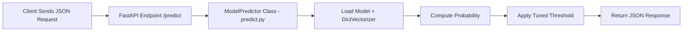

# 🏠 Astana Apartment Price Prediction - ML Project

This project implements an end-to-end machine learning pipeline for predicting apartment prices in Astana, Kazakhstan, using real estate data scraped from krisha.kz (dataset was taken from Kaggle)

## Features

- Comprehensive data cleaning and feature engineering pipeline
- Multiple gradient boosting models (XGBoost, LightGBM, CatBoost) comparison
- Hyperparameter optimization with Optuna
- Dual-metric optimization (RMSE and MAPE)
- Production-ready model serialization
- Detailed error analysis by price segments

The model predicts apartment prices in USD based on property characteristics, location, and building features.

---

## 🧩 Problem Statement

Real estate pricing is complex and influenced by multiple factors. Accurate price predictions help:

- **Buyers** - Make informed purchase decisions
- **Sellers** - Set competitive listing prices
- **Agents** - Provide data-driven valuations
- **Investors** - Identify undervalued opportunities

**Objective:**
- Predict apartment sale price in USD
- Minimize prediction error across different price ranges
- Provide interpretable results with feature importance

This project demonstrates a complete ML workflow from raw data to production-ready models.

---

## 📊 Dataset Description

- **Source:** https://www.kaggle.com/datasets/muraraimbekov/astana-real-estate-2025
- **Initial Rows:** 18,388 listings
- **Final Rows:** 15,556 (after cleaning)
- **Columns:** 28 features after engineering
- **Target:** `price_usd` (apartment sale price)

### Feature Categories (after cleaning)

**Physical Attributes:**
- `rooms` - Number of rooms
- `area` - Total area (m²)
- `living_area` - Living space (m²)
- `kitchen_area` - Kitchen space (m²)
- `floor` - Floor number
- `total_floors` - Building height
- `ceiling_height` - Ceiling height (m)

**Building Characteristics:**
- `house_type` - Construction type (brick, monolithic, panel, other)
- `building_age` - Years since construction
- `building_stage` - Under construction flag

**Location:**
- `district` - City district (Yesil, Nura, Almaty, Saryarka, Saryshyk, Baikonur)
- `latitude` - Geographic coordinate
- `longitude` - Geographic coordinate

**Amenities & Features:**
- `parking` - Parking availability
- `furniture` - Furnishing status
- `condition` - Renovation condition
- `bathroom_count` - Number of bathrooms
- `bathroom_type` - Bathroom configuration
- `balcony_type` - Balcony/loggia type
- `wooden_floor` - Premium flooring indicator
- `security_high` - Security features
- `has_window_grills` - Security bars

**Engineered Features:**
- `floor_relative` - floor / total_floors
- `living_ratio` - living_area / area
- `kitchen_ratio` - kitchen_area / area
- `price_per_m2` - Price per square meter

---

## 🔍 Data Cleaning & Feature Engineering

### Data Quality Issues Addressed

**1. Missing Values:**
- `ceiling_height` - Filled with 2.7m (median), 3.0m for luxury (>$1,300/m²)
- `floor` / `total_floors` - Filled with -1 for missing floor information
- `living_area` - Imputed using mean ratio (71.3% of total area)
- `kitchen_area` - Imputed using mean ratio (20.4% of total area)

**2. Outliers Removed:**
- Rows with >9 missing values (high data quality threshold)
- Area > 150 m² (extreme outliers)
- Price per m² > $3,500 (exclude super-luxury/unrealistic pricing)
- Ceiling height > 5m (data errors)

**3. Data Validation:**
- Fixed invalid kitchen_area (>35% of total area)
- Fixed invalid living_area (>95% of total area)
- Verified floor ≤ total_floors consistency

### Feature Engineering

**Categorical Encoding:**
- `house_type` - Mapped to English: monolithic, brick, panel, other, unknown
- `condition` - Mapped: new, good, rough, needs_repair, unknown
- `bathroom_type` - Extracted from text: combined, separate, multiple
- `balcony_type` - Categorized: balcony, loggia, multiple, unknown
- `parking` - Mapped: private_parking, public_parking, garage, no_parking
- `furniture` - Mapped: fully_furnished, partially_furnished, unfurnished, unknown
- `district` - Translated to English names

**Binary Features:**
- `wooden_floor` - Premium flooring indicator
- `security_high` - High security features (security, alarm, concierge)
- `has_window_grills` - Window security bars (high danger area)
- `building_stage` - Under construction flag

**Derived Features:**
- `bathroom_count` - Extracted count (0, 1, 2+)
- `building_age` - 2026 - year_built

---

## 🤖 Modeling Approach

### 1. Data Split Strategy

- **Training:** 70% (10,889 samples)
- **Validation:** 15% (2,333 samples)  
- **Test:** 15% (2,334 samples)

**Preprocessing:**
- Target transformation: `log1p(price_usd)` for stable training
- Numeric features: Used as-is (no scaling for tree models)
- Categorical features: One-hot encoded for XGBoost/LightGBM, native encoding for CatBoost

### 2. Baseline Model Comparison

Three gradient boosting algorithms evaluated:

| Model | Test RMSE | Test R² | Test MAPE | Training Approach |
|-------|-----------|---------|-----------|-------------------|
| **XGBoost** | **$14,905** | **0.9175** | **9.48%** | 1000 rounds, early stopping |
| LightGBM | $15,341 | 0.9126 | 9.67% | 920 rounds (early stopped) |
| CatBoost | $15,259 | 0.9135 | 9.97% | 999 rounds, native categorical |

**Winner: XGBoost** selected for best RMSE and balanced performance.

**Baseline XGBoost Configuration:**
```python
{
    'n_estimators': 1000,
    'learning_rate': 0.05,
    'max_depth': 6,
    'subsample': 0.8,
    'colsample_bytree': 0.8,
    'random_state': 42
}
```

### 3. Hyperparameter Optimization

**Framework:** Optuna with 25 trials per model per metric

**Dual-Metric Strategy:**
- Optimize separately for RMSE (financial accuracy)
- Optimize separately for MAPE (percentage error)

**Search Spaces:**

**XGBoost:**
- n_estimators: [500, 2500]
- learning_rate: [0.01, 0.1] (log scale)
- max_depth: [4, 10]
- min_child_weight: [1, 7]
- subsample: [0.6, 1.0]
- colsample_bytree: [0.6, 1.0]
- reg_alpha: [1e-8, 10.0] (log scale)
- reg_lambda: [1e-8, 10.0] (log scale)
- gamma: [1e-8, 1.0] (log scale)

**LightGBM:**
- n_estimators: [500, 2500]
- learning_rate: [0.01, 0.1] (log scale)
- max_depth: [4, 12]
- num_leaves: [20, 100]
- min_child_samples: [10, 50]

**CatBoost:**
- iterations: [500, 2500]
- learning_rate: [0.01, 0.1] (log scale)
- depth: [4, 10]
- l2_leaf_reg: [1e-8, 10.0] (log scale)

### 4. Final Model Performance

**Best Model: XGBoost (RMSE-optimized)**

**Optimal Hyperparameters:**
```python
{
    'n_estimators': 2500,
    'learning_rate': 0.022,
    'max_depth': 8,
    'min_child_weight': 7,
    'subsample': 0.71,
    'colsample_bytree': 0.60,
    'reg_alpha': 2.22e-05,
    'reg_lambda': 0.037,
    'gamma': 1.49e-08
}
```

**Test Set Performance:**

| Metric | Value |
|--------|-------|
| RMSE | $14,905 |
| MAE | $8,546 |
| R² | 0.9175 |
| MAPE | 9.48% |

**Error Analysis by Price Segment:**

| Price Range | Mean Absolute Error | Mean Absolute % Error |
|-------------|--------------------|-----------------------|
| < $50k | $3,341 | 9.20% |
| $50-80k | $5,543 | 8.61% |
| $80-110k | $8,964 | 9.70% |
| > $110k | $19,678 | 11.12% |

**Key Insights:**
- Model performs consistently across price ranges
- Slightly higher percentage error for luxury segment (>$110k)
- Strong R² indicates excellent explanatory power
- MAPE under 10% indicates production-ready accuracy

---

## 📈 Model Comparison Results

### All Optimized Models

| Model | Optimized For | Test RMSE | Test R² | Test MAPE |
|-------|---------------|-----------|---------|-----------|
| **XGBoost_RMSE** | **RMSE** | **$14,905** | **0.9175** | **9.48%** |
| XGBoost_MAPE | MAPE | $15,267 | 0.9135 | 9.42% |
| LightGBM_RMSE | RMSE | $15,341 | 0.9126 | 9.67% |
| LightGBM_MAPE | MAPE | $15,428 | 0.9116 | 9.58% |
| CatBoost_RMSE | RMSE | $15,259 | 0.9135 | 9.97% |
| CatBoost_MAPE | MAPE | $15,384 | 0.9121 | 9.85% |

**Conclusion:** XGBoost optimized for RMSE provides the best overall performance with lowest error and highest R².

---

## 🛠️ Project Structure

```
├── dataset/
│   ├── astana_apartments.csv           # Raw scraped data
│   └── astana_apartments_ready.csv     # Cleaned dataset
├── eda-cleaning.ipynb                  # Data exploration & cleaning
├── train-model.ipynb                   # Model training & optimization
├── requirements.txt                    # Python dependencies
└── README.md                          # This file
```

---

## 🚀 Running the Project

### 1. Setup Environment

```bash
python -m venv venv
source venv/bin/activate  # On Windows: venv\Scripts\activate
pip install -r requirements.txt
```

### 2. Data Preparation

Run `eda-cleaning.ipynb` to:
- Load raw data from `dataset/astana_apartments.csv`
- Clean and validate features
- Engineer new features
- Save to `dataset/astana_apartments_ready.csv`

### 3. Model Training

Run `train-model.ipynb` to:
- Load cleaned dataset
- Train baseline models (XGBoost, LightGBM, CatBoost)
- Run Optuna hyperparameter optimization
- Compare all model variants
- Save best model to `midterm_model.bin`

---

## 📊 Key Technologies

- **Data Processing:** pandas, numpy
- **Machine Learning:** scikit-learn, xgboost, lightgbm, catboost
- **Optimization:** optuna
- **Visualization:** matplotlib, seaborn (in notebooks)

---

## ⚠️ Limitations

- **Data Recency:** Model trained on January 2026 snapshot; requires retraining for market changes
- **Geographic Scope:** Limited to Astana, Kazakhstan
- **Feature Completeness:** Some listings had missing amenity details
- **Market Dynamics:** Does not account for seasonal variations or economic events
- **External Factors:** Excludes macro-economic indicators (interest rates, inflation)

---

## 🎯 Future Improvements

**Model Enhancements:**
- [ ] Time-series features (listing duration, price changes)
- [ ] External data (proximity to metro, schools, parks)
- [ ] Ensemble stacking of top models
- [ ] Deep learning with embeddings for text descriptions
- [ ] Automated retraining pipeline

**Production Deployment:**
- [ ] FastAPI inference service
- [ ] Docker containerization
- [ ] Model versioning with MLflow
- [ ] A/B testing framework
- [ ] Real-time price monitoring dashboard

**Feature Engineering:**
- [ ] Neighborhood price trends
- [ ] Developer reputation scores
- [ ] Walkability scores
- [ ] Public transport accessibility metrics

---

## 📝 Model Selection Rationale

**Why XGBoost?**

1. **Best Performance:** Lowest RMSE ($14,905) among all tested models
2. **Robust Generalization:** Consistent performance across train/val/test
3. **Feature Interactions:** Excellent at capturing complex relationships
4. **Production Proven:** Widely used in real estate price prediction
5. **Interpretability:** Supports feature importance analysis

**Why Not Others?**
- **LightGBM:** Slightly higher RMSE, though faster training
- **CatBoost:** Better categorical handling, but higher MAPE
- **Linear Models:** Underfitted (tested but not shown, R² < 0.75)

---

## 🤝 Contributing

This is an educational project demonstrating ML best practices. Suggestions for improvements welcome!

---

## 📄 License

MIT License - feel free to use for learning and non-commercial purposes.

---

**Project Status:** ✅ Complete - Model trained and evaluated

**Last Updated:** January 2026

------------------------------------------------------------------------

## 🤖 Modeling Approach

### 1. Data Split

-   60% Train
-   20% Validation
-   20% Test

### 2. Models Evaluated

| Model                 | Pros                                     | Cons                             |
|-----------------------|------------------------------------------|----------------------------------|
| Logistic Regression   | Interpretable                            | Underfits nonlinear relations    |
| Decision Tree         | Captures interactions                    | Overfits easily                  |
| Random Forest (Selected) | Best accuracy, robust, handles mixed features | Larger model size                |


**Random Forest chosen** for stable performance and good probability
calibration.

### 3. Threshold Optimization

A sweep from 0.1--0.8 determined the F1-maximizing threshold.
Stored along with:

-   RandomForest model
-   DictVectorizer
-   Final probability cutoff

Saved in: `midterm_model.bin`

### 4. Final Performance

| Metric     | Score   |
|------------|---------|
| Accuracy   | ~0.9311 |
| Precision  | ~0.93   |
| Recall     | ~0.93   |
| F1-Score   | ~0.8374 |
| AUC-ROC    | ~0.9748 |

------------------------------------------------------------------------

## 🏛️ API Service Architecture



------------------------------------------------------------------------

## 🚀 Running the Project

### 1. Run with Docker (recommended)

**Using docker-compose**

    docker-compose up -d

**Manual build/run**

    docker build -t loan-default-api .
    docker run -p 9696:9696 loan-default-api

API runs at: `http://localhost:9696`

### 2. Run Locally

    python -m venv venv
    source venv/bin/activate
    pip install -r requirements.txt
    uvicorn serve:app --host 0.0.0.0 --port 9696

------------------------------------------------------------------------

## 🌐 Cloud Deployment (DigitalOcean)

The API is fully deployed and accessible online via DigitalOcean’s App Platform:

**Live Application:**  
**👉 https://loan-default-api-app-hrbsh.ondigitalocean.app/**

This cloud-hosted version exposes the same production-ready machine learning model used locally, allowing real-time inference directly over the internet.

**Interactive Demo Form:**
**👉 https://loan-default-api-app-hrbsh.ondigitalocean.app/form**

### Available Endpoints

- **GET `/health`** — Health-check endpoint to verify the service is running  
- **POST `/predict`** — Main ML inference endpoint returning default probability and prediction  
- **GET `/form`** — Simple interactive form for manually submitting applicant data and testing predictions

## 🔌 API Documentation

### Endpoints

| Method | Endpoint | Description        |
|--------|----------|--------------------|
| GET    | /        | Welcome message    |
| GET    | /health  | Health check       |
| POST   | /predict | Generate prediction |

### Request Example

    {
      "person_age": 35,
      "person_gender": "male",
      "person_education": "Bachelor",
      "person_income": 75000,
      "person_emp_exp": 10,
      "person_home_ownership": "RENT",
      "loan_amnt": 15000,
      "loan_intent": "EDUCATION",
      "loan_int_rate": 5.5,
      "loan_percent_income": 0.2,
      "cb_person_cred_hist_length": 8,
      "credit_score": 720,
      "previous_loan_defaults_on_file": 0
    }

### Response Example

    {
      "prediction": false,
      "probability": 0.1234,
      "threshold": 0.34,
      "prediction_class": 0
    }

------------------------------------------------------------------------

## ⚠️ Limitations

-   Trained on public dataset → may not reflect real-world patterns
-   No fairness/bias review
-   No CI/CD retraining automation

------------------------------------------------------------------------

## 🛠 Next Steps

-   Feature importance stability checks
-   Stronger Pydantic input schemas
